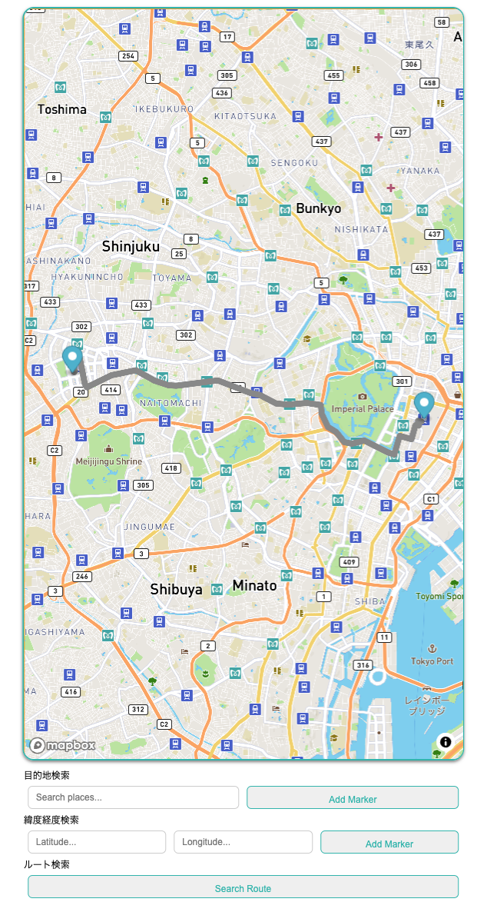

# MAP API 調査

## API 発行

[MapBox API](https://docs.mapbox.com/help/glossary/access-token/)

## Quick start

ルートディレクトリに`.env.local`ファイルを作り中身を以下のように設定する

```
NEXT_PUBLIC_MAPBOX_API_KEY="MapBox APIのKey"
```

ターミナルで以下を実行

```
$ npm i
$ npm run dev
```

## 使い方



1. http://localhost:3000/ にアクセスする
1. "MapBpx API"をクリックする
1. 目的地を検索する
   - 場所の名前で検索する場合
     - 目的地検索で目的地名を入力する
     - "Add Marker"を押す
     - 候補の最初の項目が選択されマーカーが設置される（[Geocoding v5 API](https://docs.mapbox.com/api/search/geocoding-v5/)が利用される）
   - 緯度経度から検索する場合
     - 緯度経度検索に緯度経度を入力する
     - "Add Marker"を押す
     - マーカーが設置される(API は利用しない)
1. 目的地マーカーが設置された状態で"Search Route"を押すと現在地からマーカまでのルートを検索し描画する（[Directions API](https://docs.mapbox.com/api/navigation/directions/)が利用される）

> [!NOTE]
> 現在地が位置情報に追従するかは未確認です
